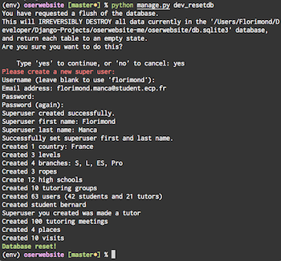
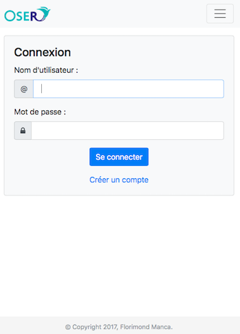
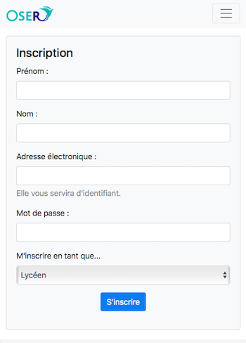
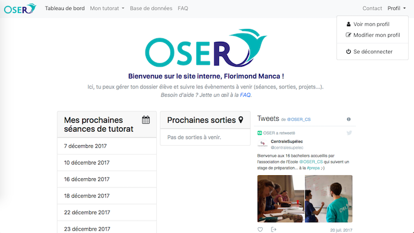
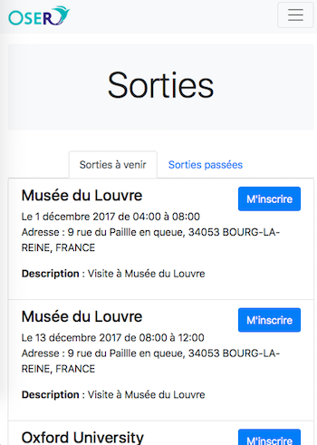
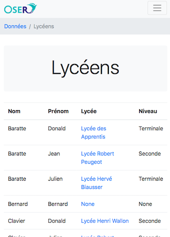
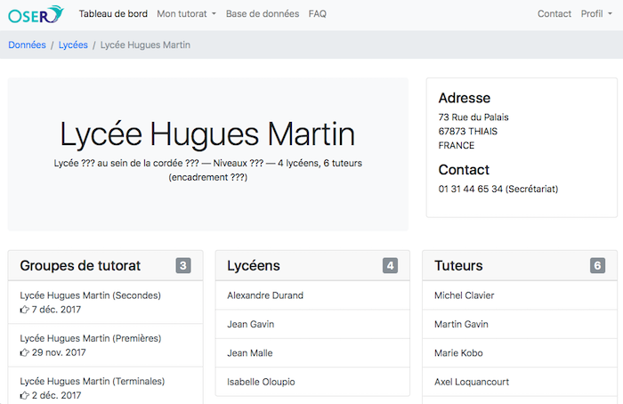

# oserwebsite-me

This repo gathers the code I used for developing a Django prototype database-oriented website for the education non-profit "OSER". It shall be used when developing the final website, planned for mid-2018.

## Installation

To run the server locally:

1. Clone the repo.
2. Create a virtual environment and `$ pip install -r requirements.txt`.
3. `$ cd oserwebsite`
4. `$ python manage.py runserver`

### Resetting the database

A custom database reset command is available through `python manage.py dev_resetdb`. It resets the database, asks you to create a super-user and fills the database with fresh mockup data.

Use it to browse the website with  the website's browsing experience.



## Features

This web app is a management system for tutoring activities. High school students can participate in tutoring groups, visits, cultural trips and internship programmes organized by the association.

- Fully responsive.
- Browsable database for site administrators.
- Content written in French — remember OSER is a French education non-profit.

### Previews

#### Login and registration

These pages allow you to login or register a new account:

 

#### Home page dashboard

The home page greets the user with a nice dashboard, including upcoming tutoring events, visits and the association's latest tweets!



#### Visits

The visits page allows students to register see what visits are available and register to them. Past visits are accessing for reference.



#### Browsable database

The site provides a browsable database for site administrators to look into. Edition and deletion are not supported yet. Below are a list view of students ("Lycéens") and a detail view of a high school ("Lycée").





## Testing

Run unit tests:

```
$ python manage.py test internal
```

Run Selenium functional tests (in Safari):

```
$ python manage.py test internal.selenium_tests
```
